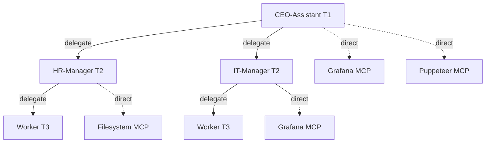

# Agent System

## What It Does

Agents in SIDJUA are organized in a three-tier hierarchy: **T1** (Executive),
**T2** (Manager), and **T3** (Worker). Each agent is defined by a YAML file
describing its identity, capabilities, and budget, and one or more Markdown
skill files that form its system prompt. Delegation flows strictly top-down —
T1 can delegate to T2, T2 can delegate to T3 — and every delegation is subject
to governance validation.

---

## Delegation Diagram

<!-- AUTO-GENERATED-DIAGRAM-START -->

<!-- AUTO-GENERATED-DIAGRAM-END -->

---

## How It Works

1. **Definition loading** — `DefinitionLoader.loadAgentDefinitions(defsDir)` scans `agents/definitions/` for `.yaml` and `.yml` files, parses each, and validates required fields. Invalid files are silently skipped.
2. **Skill file loading** — `loadSkillContent(skillsDir, skillName)` reads the corresponding `.md` file from `agents/skills/`. Path traversal is prevented with a `basename()` guard.
3. **LLM configuration** — the agent's `provider` and `model` fields select the LLM. If omitted, the workspace default provider is used.
4. **Tool assignment** — `allowed_tools` in the agent YAML restricts which MCP tool names the agent can request. The MCP registry filters the tool list before passing it to the LLM.
5. **Delegation protocol** — when a T1 or T2 agent calls `DELEGATE_TASK_TOOL`, `validateDelegationRbac()` checks the tier/division rules before a child task is created.
6. **Task execution** — the reasoning loop runs, calling tools through governance and synthesising results until a final answer is produced.

---

## Key Files

| Path | Purpose |
|------|---------|
| `agents/definitions/` | Agent YAML definition files |
| `agents/skills/` | Agent skill Markdown files (system prompt content) |
| `src/core/agents/definition-loader.ts` | `loadAgentDefinitions()`, `loadSkillContent()` |
| `src/core/delegation/delegation-protocol.ts` | `validateDelegationRbac()`, `DelegationManager`, `DELEGATE_TASK_TOOL` |
| `src/core/delegation/index.ts` | Barrel export |
| `src/core/agents/agent-runtime.ts` | Agent lifecycle, reasoning loop wiring |

---

## Configuration

### Agent YAML definition

```yaml
# agents/definitions/my-agent.yaml

id: my-agent
name: My Agent
tier: 2                         # 1 = Executive, 2 = Manager, 3 = Worker
division: engineering

provider: anthropic             # optional — defaults to workspace default
model: claude-haiku-4-5-20251001

skills:
  - my-agent-core               # loaded from agents/skills/my-agent-core.md
  - my-agent-tools              # multiple skill files are concatenated

allowed_tools:
  - filesystem_read_file
  - filesystem_write_file
  - github_create_issue

can_delegate_to:
  - my-worker-agent             # IDs of agents this agent can delegate to

budget:
  per_task_usd: 0.50
  per_day_usd: 5.00

max_classification: INTERNAL    # PUBLIC | INTERNAL | CONFIDENTIAL | SECRET | FYEO
```

### Skill file template

```markdown
# My Agent — Core Skills

## Role

You are [agent name], a [role description] for [organisation].
Your primary responsibility is [main responsibility].

## Available Tools

| Tool | Purpose |
|------|---------|
| `filesystem_read_file` | Read files from the workspace |
| `filesystem_write_file` | Write files to the workspace |

## Behaviour Guidelines

- [Guideline 1]
- [Guideline 2]
- Always confirm before performing destructive actions.

## Response Format

[Describe expected output format, tone, language]
```

---

## Delegation Rules

| From tier | To tier | Same division? | Allowed? |
|-----------|---------|---------------|---------|
| T1 | T2 | Any | Yes |
| T2 | T3 | Same | Yes |
| T2 | T2 | Same | Yes |
| T2 | T2 | Different | **No** |
| T3 | Any | Any | **No** |
| T1 | T3 | Any | **No** (must go T1→T2→T3) |

---

## Common Questions

**Can T3 agents delegate?**

No. T3 workers are leaf nodes. Any attempt to call `DELEGATE_TASK_TOOL` from a
T3 agent returns a `T3_NO_DELEGATION` error from the governance pipeline.

**How do I create a new agent?**

1. Copy an existing definition from `agents/definitions/` and rename it.
2. Update `id`, `name`, `tier`, `division`, `skills`, and `allowed_tools`.
3. Create the corresponding skill file(s) in `agents/skills/`.
4. Restart the daemon or run `sidjua agent reload` to pick up the new definition.

**Can I use a different LLM for each agent?**

Yes. Set `provider` and `model` in the agent YAML. Supported providers are
`anthropic`, `openai`, and any OpenAI-compatible endpoint configured via
`sidjua provider add`.

**How are skill files combined?**

Skill files are loaded in order and concatenated with a blank line between
them. The combined text becomes the agent's system prompt. Keep individual
skill files focused on a single area of responsibility.

**How do I limit what an agent can do?**

Use `allowed_tools` to whitelist specific tool names. Use `max_classification`
to cap the data sensitivity level. Use `budget.per_task_usd` to limit cost.
All three controls are enforced independently by the governance pipeline.
