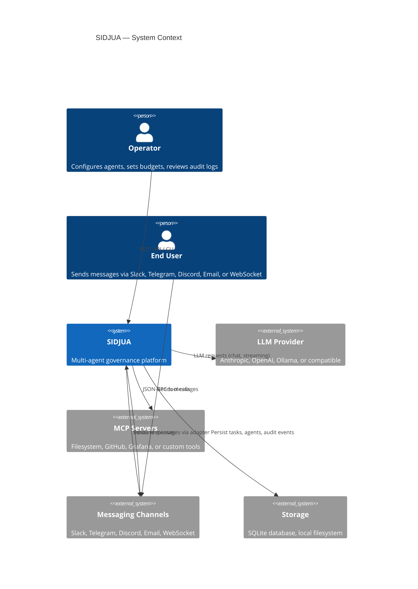
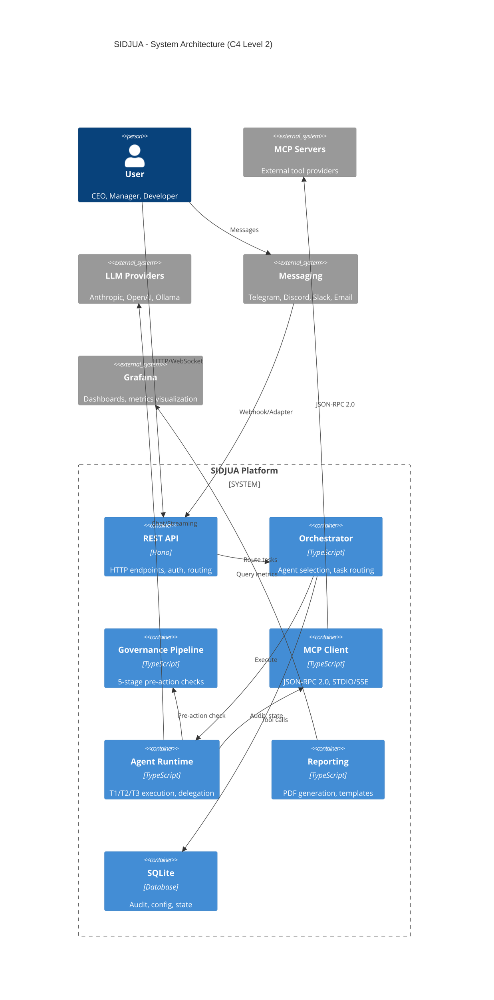
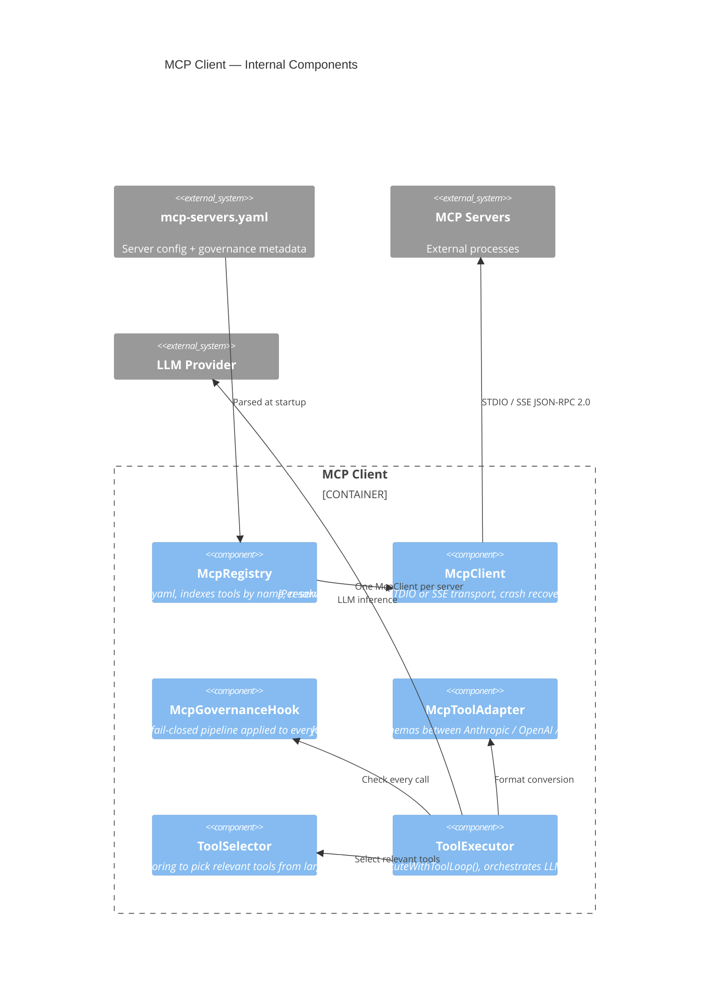
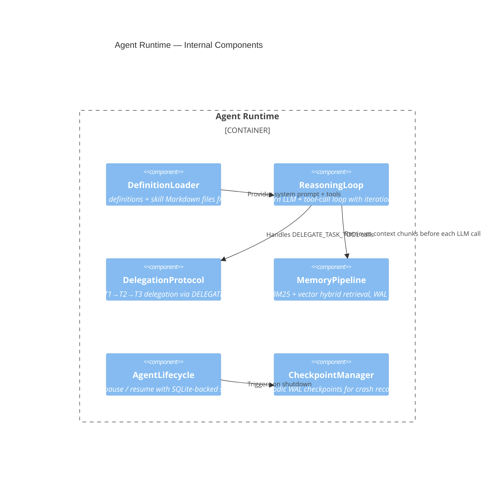

# SIDJUA Architecture

## What It Does

SIDJUA is a governed AI agent platform where every agent action is subject to
multi-stage governance before execution. Agents are organized in a three-tier
hierarchy (T1/T2/T3) and communicate via channel adapters, the REST API, and
the MCP protocol. The architecture is modular: an orchestrator coordinates
agents, a governance pipeline enforces policy, an MCP client bridges external
tools, and an agent runtime manages lifecycle and memory.

---

## System Context (C4 Level 1)



---

## Container Diagram (C4 Level 2)

<!-- AUTO-GENERATED-DIAGRAM-START -->

<!-- AUTO-GENERATED-DIAGRAM-END -->

---

## How It Works

1. **Message received** — a user sends a message via a channel (Slack, Telegram, Discord, Email, or WebSocket) or directly to the REST API.
2. **Channel adapter** — the messaging gateway normalises the inbound message into a standard format and forwards it as an HTTP request to `POST /api/v1/chat/:agentId`.
3. **API layer** — the REST API authenticates the request (scoped API token or Bearer key), applies rate limiting and input sanitisation, then routes to the chat handler.
4. **Task creation** — the chat handler creates a task record in SQLite via `ExecutionBridge.submitTask()` and emits a `TASK_CREATED` event on the internal event bus.
5. **Orchestrator picks up** — the orchestrator's event loop detects the new task and selects the target agent based on the task's `assigned_agent` field.
6. **Budget pre-check** — `TaskAdmissionGate` verifies the agent's division has remaining budget before the agent loop starts.
7. **Agent runtime starts** — the agent runtime loads the agent definition (YAML) and skill files (Markdown), then begins the reasoning loop.
8. **LLM request** — the reasoning loop calls the configured LLM provider (via `ProviderAdapter`) with the conversation history and available tools.
9. **Tool call decision** — the LLM returns a tool-use request; the reasoning loop passes it to the governance pipeline.
10. **Governance pipeline** — the 6-stage pipeline checks RBAC, budget ceiling, forbidden patterns, classification level, escalation threshold, and rate limit. Any stage can block the call.
11. **MCP call** — if governance approves, the MCP client sends a JSON-RPC 2.0 request to the appropriate tool server and returns the result.
12. **Result to LLM** — the tool result is appended to the conversation and sent back to the LLM for synthesis.
13. **Loop repeats** — steps 8–12 repeat until the LLM returns a final text response (no more tool calls) or the iteration ceiling is reached.
14. **Task complete** — the reasoning loop marks the task `DONE` and emits a `TASK_COMPLETED` event.
15. **Response dispatched** — the response router sends the answer back to the originating channel or API caller; audit events are written for every tool call.

---

## Key Files

| Path | Purpose |
|------|---------|
| `src/api/` | REST API server, middleware, all route handlers |
| `src/core/orchestrator.ts` | Task scheduling, agent selection, event bus |
| `src/core/governance/` | Governance types, rollback, CLI commands |
| `src/core/mcp/` | MCP client, registry, governance hook, tool adapters |
| `src/core/agents/` | Agent definition loader, agent runtime |
| `src/core/delegation/` | Delegation protocol, RBAC validation |
| `src/core/reporting/` | PDF/HTML report generation |
| `src/core/messaging/` | Channel adapters, inbound gateway, response router |
| `agents/definitions/` | Agent YAML definitions |
| `agents/skills/` | Agent skill Markdown files |

---

## MCP Client Internals (C4 Level 3)



---

## Agent Runtime Internals (C4 Level 3)



---

## Configuration

Agent definitions live in `agents/definitions/*.yaml`. Governance rules are in
`config/governance.yaml`. MCP server configuration is in `config/mcp-servers.yaml`
(copied from `config/mcp-servers.yaml.default` by `sidjua init`).

Environment variables relevant to the architecture are documented in
`.env.example`.

---

## Testing

```bash
# Full test suite
npm test

# Architecture-related tests
npx vitest run tests/core/
npx vitest run tests/agent-runtime/
npx vitest run tests/orchestrator/
```
