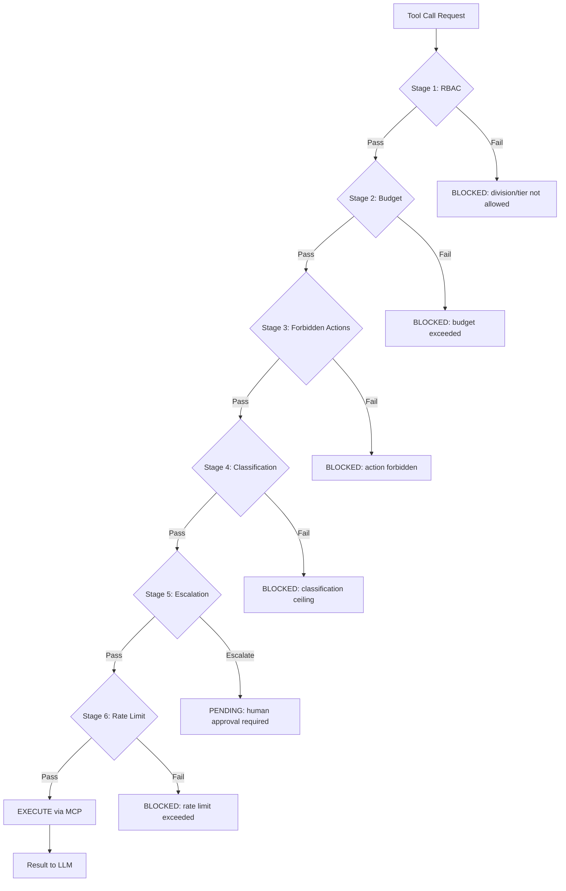

# Governance Pipeline

## What It Does

Every agent action — every tool call — passes through a 6-stage governance
pipeline before execution. The pipeline is **fail-closed**: if any stage
throws an error or returns an unexpected result, the action is blocked. No
stage can be disabled at runtime; this is a deliberate design decision to
ensure safety guarantees hold even under unexpected conditions.

---

## Pipeline Diagram

<!-- AUTO-GENERATED-DIAGRAM-START -->

<!-- AUTO-GENERATED-DIAGRAM-END -->

---

## How It Works

### Stage 1: RBAC

Checks whether the calling agent's **tier** (T1/T2/T3) and **division** are
listed in the tool's `allowed_tiers` and `allowed_divisions` configuration.
Agents not meeting either constraint are blocked immediately. Configuration
lives in `mcp-servers.yaml` under each server's `governance` block.

### Stage 2: Budget

Sums the agent's accumulated `cost_used` across all active tasks and checks
it against the per-task and per-day budget limits defined in the agent's YAML
definition. If adding the estimated cost of this call would exceed either
limit, the call is blocked and a `BUDGET_EXHAUSTED` event is emitted.

### Stage 3: Forbidden Actions

Compares the tool name and serialised arguments against a list of
`forbidden_patterns` (regular expressions). Any match blocks the call.
This stage catches patterns like `rm -rf`, shell injection sequences, or
exfiltration paths before they reach any tool server.

### Stage 4: Classification

Each tool has a `classification_ceiling` (PUBLIC / INTERNAL / CONFIDENTIAL /
SECRET / FYEO). Each agent has a `max_classification` in its YAML definition.
If the tool's ceiling is above the agent's maximum, the call is blocked.
This prevents lower-trust agents from accessing sensitive data sources.

### Stage 5: Escalation

If the tool's `risk_level` or an explicit escalation rule in `governance.yaml`
indicates that human review is required, the pipeline emits an escalation
event and blocks execution pending approval. Escalation thresholds are
configurable per server and per division.

### Stage 6: Rate Limit

Enforces `max_calls_per_minute` per agent per tool using an in-memory sliding
window. Burst traffic from runaway loops is blocked here before it reaches
external tool servers.

---

## Key Files

| Path | Purpose |
|------|---------|
| `src/core/mcp/mcp-governance-hook.ts` | 6-stage pipeline implementation |
| `src/core/mcp/types.ts` | `McpServerConfig`, governance field types, risk levels |
| `config/governance.yaml` | Global escalation rules and classification policies |
| `config/mcp-servers.yaml` | Per-server governance metadata |
| `src/governance/` | Governance snapshot / rollback CLI |

---

## Configuration

### Adding a forbidden pattern

In `config/mcp-servers.yaml`, under the relevant server:

```yaml
servers:
  my-server:
    command: node
    args: [./my-server/index.js]
    governance:
      forbidden_patterns:
        - "rm\\s+-rf"
        - "DROP\\s+TABLE"
        - "curl.*--upload-file"
```

### Setting budget limits per agent

In `agents/definitions/my-agent.yaml`:

```yaml
budget:
  per_task_usd: 0.50
  per_day_usd: 5.00
```

### Configuring classification ceiling

```yaml
# agents/definitions/my-agent.yaml
max_classification: INTERNAL   # PUBLIC | INTERNAL | CONFIDENTIAL | SECRET | FYEO

# config/mcp-servers.yaml — per server
governance:
  classification_ceiling: CONFIDENTIAL
```

### Configuring escalation thresholds

```yaml
# config/governance.yaml
escalation:
  default_threshold: CONFIDENTIAL   # escalate when tool classification >= this
  divisions:
    hr:
      threshold: INTERNAL           # HR agents escalate earlier
```

### Setting rate limits

```yaml
# config/mcp-servers.yaml
governance:
  max_calls_per_minute: 20
```

---

## Testing

```bash
# Unit tests for the governance pipeline
npx vitest run tests/core/mcp/mcp-governance-hook.test.ts

# Integration: verify a forbidden pattern blocks
# Create a test agent with a forbidden pattern, then attempt the call:
sidjua agent run my-test-agent --message "run rm -rf /tmp/test"
# → expect: blocked, audit event written

# Check audit log for governance events
sidjua audit list --filter action=blocked --limit 20
```

### Manual test scenarios

| Scenario | Expected result |
|----------|----------------|
| T3 agent calls T1-only tool | Blocked at Stage 1 |
| Agent exceeds per-task budget | Blocked at Stage 2 |
| Tool call contains `rm -rf` | Blocked at Stage 3 |
| T3 agent requests SECRET-classified tool | Blocked at Stage 4 |
| HIGH-risk tool in hr division | Escalated at Stage 5 |
| 21 calls/min to a 20/min tool | Blocked at Stage 6 |

---

## Common Questions

**Can I disable a stage?**

No. The pipeline is fail-closed by design. Disabling any stage would require a
code change and a new deployment. If a stage is too restrictive for your use
case, adjust the governance configuration (e.g., raise the budget limit or
remove a forbidden pattern).

**How do I escalate everything from a division?**

Set the escalation threshold to `PUBLIC` for that division in `governance.yaml`.
Every tool call — regardless of classification — will require human approval.

```yaml
escalation:
  divisions:
    sensitive-division:
      threshold: PUBLIC
```

**What happens when budget runs out?**

All tool calls from that agent are blocked at Stage 2. The orchestrator emits
a `BUDGET_EXHAUSTED` event which can trigger a notification via the messaging
gateway. The agent can be re-enabled after the budget period resets (daily
limits reset at midnight UTC).

**How do I audit governance decisions?**

Every blocked or escalated action writes an entry to the `audit_events` table.
Use `sidjua audit list` or query the database directly. The REST API exposes
`GET /api/v1/audit` for programmatic access.
