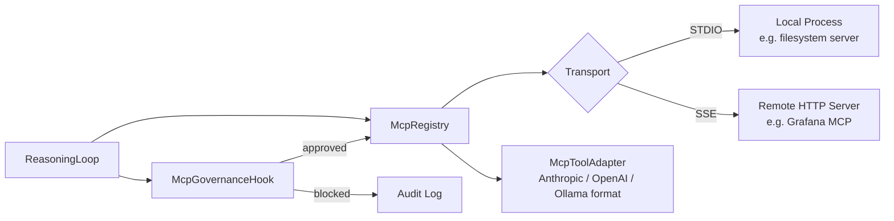

# MCP Client

## What It Does

SIDJUA connects to external tool providers via the **Model Context Protocol
(MCP)**, an open standard for exposing capabilities to LLM agents. Two
transports are supported: **STDIO** (spawns a local process) and **SSE**
(connects to a remote HTTP server). All tool calls route through the
governance pipeline before reaching the tool server, and every call is
recorded in the audit log.

---

## Architecture



---

## How It Works

1. **Config load** — at startup, `McpRegistry` reads `config/mcp-servers.yaml` and resolves `${secrets:KEY}` references from the encrypted secrets store.
2. **Server start** — for each enabled server, the registry starts an `McpClient`. STDIO clients spawn a subprocess; SSE clients open a persistent HTTP connection.
3. **Tool list** — each client calls `tools/list` via JSON-RPC 2.0. The registry indexes every tool by name for fast lookup.
4. **Agent request** — when the LLM returns a tool-use request, the reasoning loop calls `McpRegistry.getServerForTool(toolName)` to find the responsible server.
5. **Governance check** — before any call is made, `McpGovernanceHook.check()` runs all 6 pipeline stages. A block or escalation terminates the flow here.
6. **Format conversion** — `McpToolAdapter` converts the tool schema between LLM provider formats (Anthropic `tool_use`, OpenAI `function`, Ollama `tool`).
7. **JSON-RPC call** — the approved call is dispatched to the tool server as `tools/call` with the validated arguments.
8. **Result processing** — the tool server returns a `content` array. The client extracts the text content and passes it back to the reasoning loop.
9. **LLM synthesis** — the result is appended to the conversation and forwarded to the LLM for the next reasoning step.
10. **Crash recovery** — if a STDIO server crashes, the client waits 30 seconds and restarts it automatically. After 3 failed restarts, the server is marked unhealthy and tool calls to it return an error.

---

## Key Files

| Path | Purpose |
|------|---------|
| `src/core/mcp/types.ts` | JSON-RPC 2.0 types, `McpTool`, `McpServerConfig`, governance field types, risk levels |
| `src/core/mcp/mcp-client.ts` | Per-server connection: STDIO + SSE transports, crash recovery, JSON-RPC dispatcher |
| `src/core/mcp/mcp-registry.ts` | YAML parsing, secret resolution, tool index, `initializeWithModules()` |
| `src/core/mcp/mcp-governance-hook.ts` | 6-stage fail-closed governance pipeline |
| `src/core/mcp/mcp-tool-adapter.ts` | Format conversion between Anthropic / OpenAI / Ollama |
| `src/core/mcp/tool-selector.ts` | Keyword scoring for large tool catalogs (`selectRelevantTools()`) |
| `src/core/mcp/tool-executor.ts` | `executeWithToolLoop()` — top-level LLM ↔ tool orchestration |
| `src/core/mcp/tool-executor-streaming.ts` | Streaming variant using `AsyncGenerator<LlmStreamEvent>` |
| `src/core/mcp/context-budget.ts` | `estimateTokens()` + `compressContext()` for context window management |
| `src/core/mcp/memory-verifier.ts` | Path existence + workDir boundary checks for memory references |
| `config/mcp-servers.yaml.default` | Template copied by `sidjua init` |

---

## Configuration

`config/mcp-servers.yaml` defines which MCP servers are available and their
governance metadata. The file is created from the default template when you
run `sidjua init`.

```yaml
# config/mcp-servers.yaml

servers:
  # Example 1: filesystem server (STDIO)
  filesystem:
    command: npx
    args: [-y, "@modelcontextprotocol/server-filesystem", "/home/user/data"]
    governance:
      allowed_tiers: [1, 2, 3]
      allowed_divisions: []            # empty = all divisions
      max_calls_per_minute: 60
      forbidden_patterns:
        - "\\.env"
        - "\\.ssh"
      classification_ceiling: INTERNAL
      budget_per_call: 0.001

  # Example 2: GitHub (STDIO with secret)
  github:
    command: npx
    args: [-y, "@modelcontextprotocol/server-github"]
    env:
      GITHUB_PERSONAL_ACCESS_TOKEN: "${secrets:GITHUB_TOKEN}"
    governance:
      allowed_tiers: [1, 2]
      allowed_divisions: [engineering, devops]
      max_calls_per_minute: 30
      classification_ceiling: CONFIDENTIAL
      risk_level: MEDIUM

  # Example 3: Grafana (SSE remote)
  grafana:
    type: sse
    url: "http://localhost:3001/mcp"
    governance:
      allowed_tiers: [1, 2]
      allowed_divisions: [ops, engineering]
      max_calls_per_minute: 20
      classification_ceiling: INTERNAL
```

### Governance fields reference

| Field | Type | Description |
|-------|------|-------------|
| `allowed_tiers` | `number[]` | Agent tiers permitted to use this server (1=T1, 2=T2, 3=T3) |
| `allowed_divisions` | `string[]` | Division IDs permitted; empty array = all divisions |
| `max_calls_per_minute` | `number` | Rate limit per agent per tool |
| `forbidden_patterns` | `string[]` | Regex patterns matched against tool name + arguments |
| `classification_ceiling` | `string` | Maximum classification level: PUBLIC / INTERNAL / CONFIDENTIAL / SECRET / FYEO |
| `budget_per_call` | `number` | Estimated USD cost per call (used for budget tracking) |
| `risk_level` | `string` | LOW / MEDIUM / HIGH / CRITICAL — triggers escalation |

---

## Testing

```bash
# Unit tests for the MCP client layer
npx vitest run tests/core/mcp/

# Test a specific server connection
sidjua mcp test filesystem

# List all registered tools
sidjua mcp tools

# Reload config without restart
sidjua mcp reload
```

### Testing with a mock MCP server

The test suite includes a lightweight in-process mock server. To write a test
that exercises the MCP client:

```typescript
import { McpClient } from "../../src/core/mcp/mcp-client.js";

// The mock server implements the tools/list and tools/call JSON-RPC methods
// See tests/core/mcp/helpers/mock-mcp-server.ts for the fixture
```

---

## Common Questions

**How do I add a new MCP server?**

The simplest method is `sidjua module add <npm-package>`, which installs the
package and registers it automatically. For manual configuration, add a new
entry to `config/mcp-servers.yaml` and run `sidjua mcp reload`.

**What if a server crashes?**

The client automatically waits 30 seconds and restarts the server process.
After 3 consecutive failed restarts within the restart window, the server is
marked unhealthy. Tool calls to an unhealthy server return a governance error
rather than hanging. Health status is visible at `GET /api/v1/mcp/servers`.

**How do I pass secrets to a server?**

Use `${secrets:KEY_NAME}` in the `env` block. SIDJUA resolves these references
from the encrypted secrets store at startup. Store a secret with
`sidjua secrets set KEY_NAME`.

**How are tool schemas converted between providers?**

`McpToolAdapter.toProviderFormat(tools, model)` detects the provider from the
model name and outputs the correct format. Tool names longer than 64 characters
are truncated with a hash suffix to comply with provider limits.

**What is tool selection?**

When an agent has access to more tools than the LLM's context window allows,
`selectRelevantTools()` keyword-scores tools against the current message and
returns the top N most relevant tools. The cap is configurable per agent.
