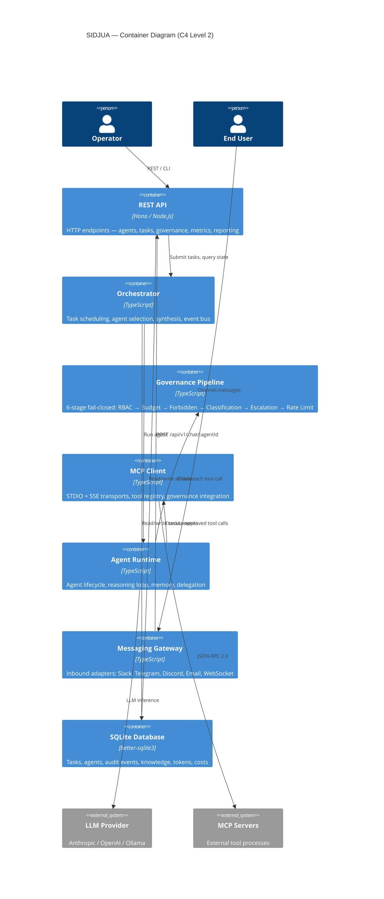

# SIDJUA Architecture Context

Version: 1.0 (hand-written initial version — auto-generated on CI builds)
Updated: 2026-04-04

---

## System Identity

SIDJUA is a governed AI agent platform that orchestrates multiple LLM-powered
agents in a corporate hierarchy: T1 Executive → T2 Manager → T3 Worker. Every
agent action passes through a 6-stage governance pipeline (RBAC, Budget,
Forbidden Actions, Classification, Escalation, Rate Limit) before execution.
SIDJUA connects to external tool providers via MCP (Model Context Protocol) and
supports 8 messaging channels (Telegram, Discord, WhatsApp, Slack, Email, Web
UI, CLI, REST API).

Key properties: fail-closed governance, SQLite persistence, multi-provider LLM
support (Anthropic, OpenAI, Ollama), Prometheus metrics, blue/green deployment.

---

## Core Concepts

**Governance Pipeline — 6 stages, fail-closed (any error = block):**
1. RBAC: agent division ∈ server.allowed_divisions AND agent tier ∈ server.allowed_tiers
2. Budget: estimated call cost ≤ agent.budgetRemaining (per-task + per-day USD limits)
3. Forbidden Actions: tool name + args not matching server.forbidden_patterns (regex list)
4. Classification: conversation sensitivity ≤ server.classification_ceiling (PUBLIC→INTERNAL→CONFIDENTIAL→SECRET→FYEO)
5. Escalation: tool not in require_approval list, or human has approved
6. Rate Limit: calls this minute < server.max_calls_per_minute

**Agent Tiers:**
- T1 Executive — Opus-class LLM, delegation + synthesis + reporting, can delegate to T2
- T2 Manager — Sonnet-class LLM, department operations, can delegate to T3 (same division only)
- T3 Worker — Sonnet/Haiku-class, task execution only, cannot delegate

**Delegation rules:** T1→T2 (any division), T2→T3 (same division only), T2→T2 (same division only), T3→any = BLOCKED.

**Divisions:** management, hr, it, engineering, research. Each agent belongs to one division. MCP tools scoped by division + tier.

**MCP (Model Context Protocol):** JSON-RPC 2.0. Two transports: STDIO (spawns local process), SSE (remote HTTP). Tool discovery via `tools/list`. Tool calls via `tools/call`. Crash recovery: 30s delay, max 3 restarts.

**Module:** an MCP server packaged with a `module.yaml` governance manifest. Installed via `sidjua module add <npm-package>`. Governance defaults in module.yaml; operator overrides in mcp-servers.yaml.

**Budget:** per-agent per-task USD limit + per-day USD limit. LLM token costs + MCP tool costs both counted. Exceeding either limit blocks all further actions until reset.

**Secrets:** encrypted at rest in SQLite secrets store. Referenced in mcp-servers.yaml as `${secrets:KEY_NAME}`. Managed via `sidjua secrets set/list/delete`.

---

## Architecture Diagram

<!-- AUTO-GENERATED-DIAGRAM-START -->

<!-- AUTO-GENERATED-DIAGRAM-END -->

---

## File Map (Key Directories)

```
src/api/                  REST API server, Hono routes, middleware (auth, rate-limit, sanitizer, drain)
src/core/orchestrator.ts  Agent selection, task routing, event bus, synthesis
src/core/governance/      Governance types, rollback, CLI commands
src/core/mcp/             MCP client, registry, governance hook, tool adapter, tool executor, context budget
src/core/agents/          Agent definition loader, agent runtime
src/core/delegation/      Inter-agent delegation protocol, RBAC validation, DELEGATE_TASK_TOOL
src/core/modules/         Module SDK: scanner, installer, scaffolder, registry bridge
src/core/import/          OpenClaw import: parser, validators, mappers, executor, skill-mapping-table
src/core/metrics/         Prometheus counter/gauge, MetricsCollector singleton
src/core/reporting/       PDF report generator, HTML templates, data aggregator
src/core/messaging/       Channel adapters, inbound gateway, response router, user mapping
src/core/db/              SQLite helpers, migration framework, backup engine, safety PRAGMAs
src/core/scheduler/       CronScheduler, DeadlineWatcher, SQLite-backed schedule ledger
src/core/webhook/         Webhook auth, token store, rate limiter, payload normaliser
src/cli/                  CLI commands: init, module, import, webhook, secrets, schedule, etc.
agents/definitions/       Agent YAML definitions (id, tier, division, model, budget, skills, tools)
agents/skills/            Agent skill Markdown files (system prompt content, loaded at runtime)
config/                   mcp-servers.yaml, governance.yaml, templates/
docs/dev/                 Developer documentation (architecture, governance, MCP, agents, glossary)
```

---

## Data Flow: User Message → Agent Response

1. User sends message via channel (Telegram, CLI, REST API, etc.)
2. Channel adapter normalises message → `POST /api/v1/chat/:agentId`
3. API authenticates (scoped token), applies rate limiting + input sanitisation
4. `ExecutionBridge.submitTask()` creates SQLite task record, emits `TASK_CREATED`
5. Orchestrator picks up event, validates budget via `TaskAdmissionGate`
6. Agent definition (YAML) + skill files (Markdown) loaded → system prompt assembled
7. Available MCP tools filtered by agent division + tier via governance config
8. LLM request: `{ messages, tools, system }` → provider adapter
9. LLM responds with text and/or `tool_use` blocks
10. For each `tool_use`: governance pipeline runs all 6 stages
11. Approved → MCP client calls `tools/call` via JSON-RPC → result appended to conversation
12. Blocked → error message appended; Escalated → task paused for human review
13. LLM continues (max 10 tool iterations by default; hard ceiling 25)
14. Final text response emitted via SSE / channel adapter
15. Audit events written: agent, tool name, args hash, result, budget delta, governance stage

---

## Data Flow: Agent Delegation

1. T1 agent issues `DELEGATE_TASK_TOOL` call with `{ to, task, budget, timeout }`
2. `validateDelegationRbac()` checks tier hierarchy + division rules
3. Orchestrator creates child task assigned to target agent with allocated budget slice
4. Child agent executes (full pipeline: governance, MCP tools, potential further delegation)
5. Child task result returned to parent agent as tool result
6. Parent agent synthesises and continues its own reasoning loop
7. Budget: deducted from parent at delegation time; partially refunded if child fails

---

## Agent Definitions (Pre-Built)

| ID | Tier | Division | Model class | Budget/day | Skills |
|----|------|----------|-------------|------------|--------|
| ceo-assistant | T1 | management | Opus | $10.00 | core, reporting |
| hr-manager | T2 | hr | Sonnet | $5.00 | core, import, onboarding |
| it-manager | T2 | it | Sonnet | $5.00 | core, grafana, health, mcp-mgmt |

---

## Governance Configuration Reference

```yaml
# config/mcp-servers.yaml — per-server governance block
governance:
  allowed_tiers: [1, 2]              # which tiers may call this server
  allowed_divisions: [engineering]   # empty = all divisions
  max_calls_per_minute: 30
  classification_ceiling: CONFIDENTIAL
  forbidden_patterns:
    - "rm\\s+-rf"
    - "DROP\\s+TABLE"
  budget_per_call: 0.001             # USD estimate per call
  risk_level: MEDIUM                 # LOW | MEDIUM | HIGH | CRITICAL
```

```yaml
# agents/definitions/my-agent.yaml — agent governance
tier: 2
division: engineering
max_classification: INTERNAL
budget:
  per_task_usd: 0.50
  per_day_usd: 5.00
allowed_tools:
  - filesystem_read_file
  - github_create_issue
```

---

## API Surface (Key Endpoints)

| Method | Path | Auth scope | Purpose |
|--------|------|-----------|---------|
| POST | /api/v1/chat/:agentId | readonly | Send message to agent |
| GET | /api/v1/chat/:agentId/stream | readonly | SSE streaming response |
| GET | /api/v1/agents | readonly | List agents + status |
| POST | /api/v1/agents/:id/start | operator | Start agent |
| GET | /api/v1/tasks/:id/status | readonly | Task status |
| GET | /api/v1/mcp/servers | readonly | MCP server health |
| GET | /api/v1/mcp/tools | readonly | Available tools |
| POST | /api/v1/mcp/servers/reload | operator | Hot-reload MCP config |
| POST | /api/v1/webhook/:agentId | (token) | Inbound webhook |
| GET | /api/v1/metrics/prometheus | operator | Prometheus text format |
| POST | /api/v1/reports/generate | operator | Generate PDF/HTML report |
| GET | /api/v1/health | public | Health check |
| GET | /api/v1/audit | readonly | Audit event log |
| POST | /api/v1/tokens | admin | Create API token |

Auth scopes (ascending privilege): readonly < operator < admin < bootstrap.

---

## Technology Stack

| Layer | Technology |
|-------|-----------|
| Runtime | Node.js ≥22, TypeScript strict mode |
| Web framework | Hono v4 |
| Database | SQLite (WAL mode, better-sqlite3) |
| LLM providers | Anthropic Claude, OpenAI, Ollama (OpenAI-compatible) |
| Tool protocol | MCP JSON-RPC 2.0, STDIO + SSE |
| Monitoring | Prometheus metrics, Grafana dashboards |
| Containerisation | Docker Compose, multi-arch (amd64 + arm64) |
| Deployment | Blue/green zero-downtime (Caddy proxy + Go sidecar) |
| Channels | Telegram (Telegraf), Discord (discord.js), Slack (@slack/bolt), WhatsApp (Baileys), Email (imapflow + nodemailer), WebSocket (ws) |
| i18n | 26 locales, flat JSON key system, `t()` helper |
